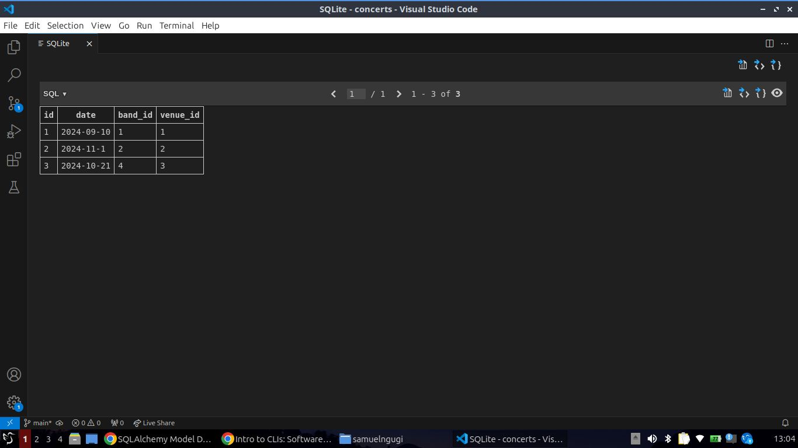
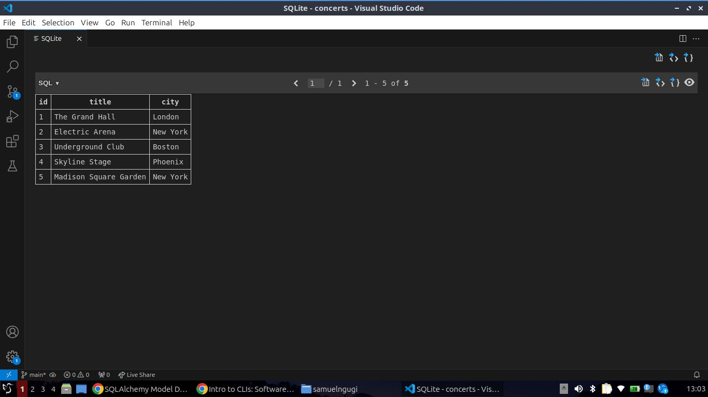

# Concert Management System
## What is it:
- The Concert Management System is a Python-based project that simulates a domain where bands perform at various venues, and concerts are held on specific dates. Using SQLAlchemy ORM, the project models three main entities: Bands, Venues, and Concerts, along with their relationships and methods to query the database. The project demonstrates how to create, query, and manage relationships between bands, venues, and concerts using an SQLite database.

## Features
### Band: 
 - Create bands with names and hometowns.
### Venue: 
 - Creates venues with titles and cities.
### Concert:
- Create concerts that associate a band and a venue with a specific date.

## Project's structure
- The project contains an app folder where the migrations folder is located, and also the concert's database, runfile and a models.py file where the project's models are created.

### Prerequisites
Before running the project, ensure you have the following installed:

- Python 3.6
- SQLAlchemy (ORM)
- SQLite (comes pre-installed with Python)
## Installing SQLAlchemy
- You can install SQLAlchemy using pip:

> pip install SQLAlchemy
# Models Overview
### Band
- Represents a musical band.

## Attributes:

- **id**: Primary key.
- **name**: Name of the band.
- **hometown**: The band's hometown.
### Relationships:
- A band has many concerts.

### Methods:

**venues()**: Returns a list of venues where the band has performed.
most_performances(session): Class method to find the band with the most performances.
## Venue
- Represents a concert venue.

## Attributes:

- **id**: Primary key.
- **title**: Name of the venue.
- **city**: The city where the venue is located.
### Relationships:
- A venue has many concerts.

## Methods:

- **bands()**: Returns a list of bands that have performed at the venue.
# Concert
Represents a concert performed by a band at a venue.

## Attributes:

- **id**: Primary key.
- **date**: Date of the concert.
- **band_id**: Foreign key to the band.
- **venue_id**: Foreign key to the venue.

### Relationships:
-A concert is associated with one band and one venue.

### Methods:

- **hometown_show()**: Returns True if the concert is in the band's hometown.
- **introduction()**: Returns an introduction message for the concert (band name, hometown, and venue city).
# How to Run the Project:
# Step 1: Clone the Repository
Clone the project repository to your local machine.

> git clone git@github.com:ngugilovesyou/concert.git

> code .

# Step 2: Create the Database and Models
- Run the runfile.py to create the database schema and populate it with initial data.

### python runfile.py
- This will create the SQLite database concerts.db and add some example bands, venues, and concerts.

## Custom Queries
- You can customize or extend the project by writing additional queries or modifying existing methods in runfile.py.

# Example display of the tables:    
## Concert Table

## Venue Table

## Concert Table

